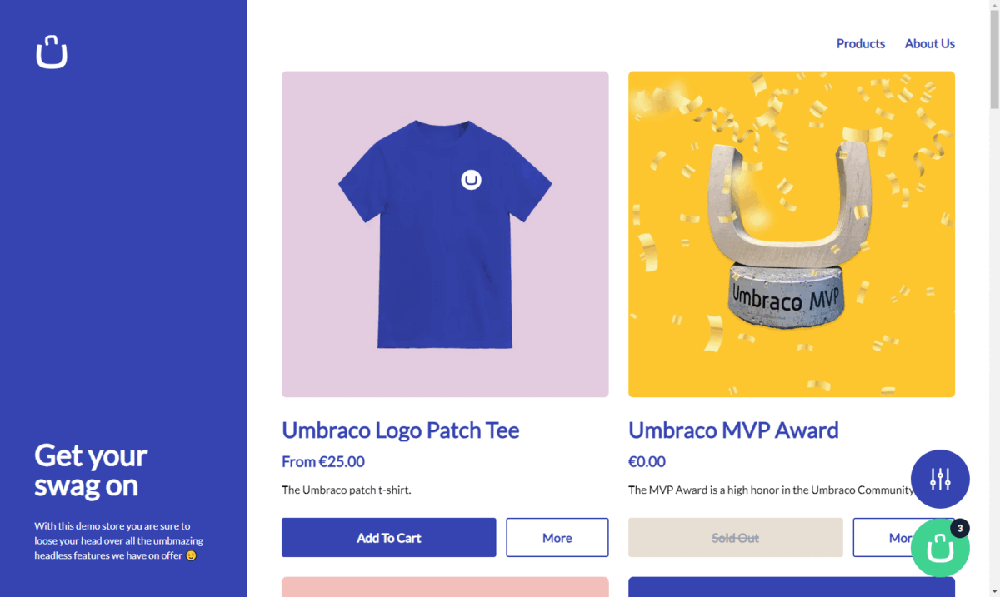

# Umbraco Headless Demo 🦄

[](https://headless-demo.umbraco.com) [](https://admin.headless-demo.umbraco.com)

The Umbraco Headless Demo is an example solution showcasing the capabilities and features of Umbraco's various headless offerings, all combined into one real-world example. The demo takes the form of a swag store with products and a full checkout flow, as well as suplimentary content pages. 



## Umbraco Content Delivery API

All of the product pages and content pages are accessed through the Umbraco Content Delivery API. The product listing page also showcase the filtering and sorting features of this API by allowing you to filter the products by search term and tags and sort the results by relevance, create date and price asc/desc.

The tags filter and price sorting are both custom extensions to the Umbraco Content Delivery API and show how you can extend the out of the box functionality for your own needs.

The following is a list of all the Umbraco Content Delivery API features made use of in this demo:

* Fetching content by path
* Fetching child content by path
* Filtering content
* Sorting content
* Customer filters
* Customer sort criteria
* Expanding properties

## Umbraco Commerce Storefront API

The cart management and checkout flow are all provided via the Umrbaco Commerce Storefront API. We showcase all the core features you would expect from a commerce API such as creating and managing an active cart, as well as capturing customer details through a checkout flow, and also managing the payment processing. We also showcase how the Umbraco Commerce property editors work seamlessly with the Umbraco Content Delivery API for easy product data retrieval.

The following is a list of all the Umbraco Commerce Storefront API features made use of in this demo:

* Creating a cart
* Managing a cart (remove items and modify quantity)
* Updating checkout details (billing, shipping, payment methods and shipping methods)
* Payment processing (inline, redirect and framed)
* Fetching store entities
* Expanding properties
* Content Delivery API friendly property editors

## Umbraco Forms API

TBC

## Getting Started

This demo is split into two parts, an Umbraco backend and a Next.js frontend. You can access the two parts within their relevant git branches. Given these are two distinct sub projects, it's best to checkout out each branch into a different folder independantly rather than checking out this main branch and switching between them.

```bash
git clone --branch backend/main https://github.com/umbraco/Umbraco.Headless.Demo.git backend
git clone --branch frontend/main https://github.com/umbraco/Umbraco.Headless.Demo.git frontend

```

For details on getting started with each part, view the README's in the respective branches

* [Getting Started - Backend](https://github.com/umbraco/Umbraco.Headless.Demo/tree/backend/main/README.md)
* [Getting Started - Frontend](https://github.com/umbraco/Umbraco.Headless.Demo/tree/frontend/main/README.md)

## Comments

If the demo site looks familiar that's because we have based it on the official Umbraco swag store. This ensures that we are using a real world example and know exactly what features should be implemented and how. 

Unfortunately the official swag store will be closing down shortly due mainly to our environmental commitments but we thought it would be nice to let the stunning design live on as part of this demo. A big thank you goes to [Perplex](https://perplex.nl/) for creating such a wonderful store design and agreeing to allow us to continue using it within this demo 🙌 

## License

Source code copyright © 2023 Umbraco A/S. Site design © 2023 Perplex Digital B.V.

This demo source code is licensed under MIT. The core Umbraco products are licensed under Umbracos commercial license.
