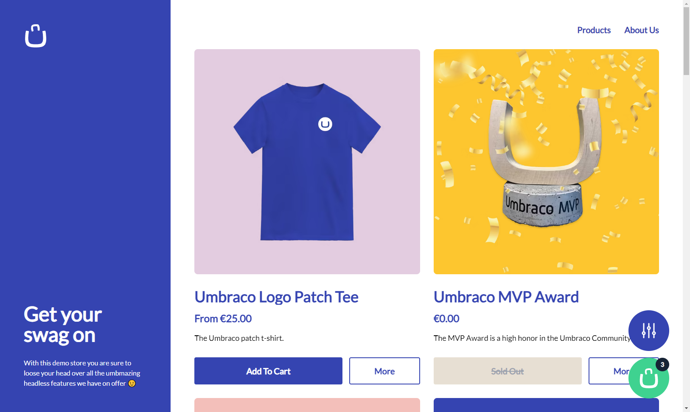

# Umbraco Headless Demo

The Umbraco Headless Demo is an example solution showcasing the capabilities and features of Umbraco's various headless offerings, all combined into one real-world example. The demo takes the form of a swag store with products and a full checkout flow, as well as suplimentary content pages. 

## Umbraco Content Delivery API

All of the product pages and content pages are accessed through the Umbraco Content Delivery API. The product listing page also showcase the filtering and sorting features of this API by allowing you to filter the products by search term and tags and sort the results by relevance, create date and price asc/desc.

The tags filter and price sorting are both custom extensions to the Umbraco Content Delivery API and show how you can extend the out of the box functionality for your own needs.

The following is a list of all the Umbraco Content Delivery API features made use of in this demo:

* Fetching content by path
* Fetching child content by path
* Filtering content
* Sorting content
* Customer filters
* Customer sort criteria
* Expanding properties

## Umbraco Commerce Storefront API

The cart management and checkout flow are all provided via the Umrbaco Commerce Storefront API. We showcase all the core features you would expect from a commerce API such as creating and managing an active cart, as well as capturing customer details through a checkout flow, and also managing the payment processing. We also showcase how the Umbraco Commerce property editors work seamlessly with the Umbraco Content Delivery API for easy product data retrieval.

The following is a list of all the Umbraco Commerce Storefront API features made use of in this demo:

* Creating a cart
* Managing a cart (remove items and modify quantity)
* Updating checkout details (billing, shipping, payment methods and shipping methods)
* Payment processing (inline, redirect and framed)
* Fetching store entities
* Expanding properties
* Content Delivery API friendly property editors

## Umbraco Forms API

TBC

## Getting Started